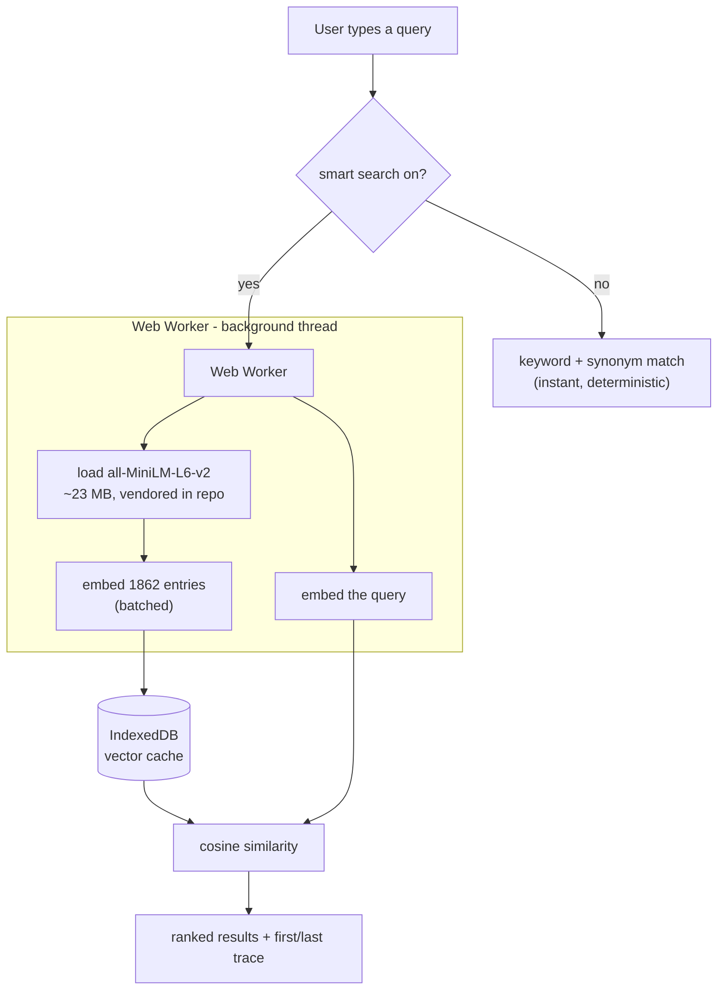

# dig

A searchable index of [The Nibble](https://nibbles.dev) - the timeless bits
(tools, TILs, reads, quotes) pulled out of every edition of the newsletter, with
the week's news left behind, **plus the links shared across the Discord
channels**. Answers "when did we first and last talk about X" for any tag or
search term - across both sources, deduped.

Live at **https://dig.nibbles.dev**

## Hosting

`index.html` is a single self-contained static file - the full index is inlined,
all logic is vanilla JS, no build step or backend at runtime. It's served by
GitHub Pages (see `CNAME`; `.nojekyll` disables Jekyll so `models/` and
`vendor/` are served as-is). To ship: commit and push.

Even the optional smart-search model is vendored into the repo (`models/` and
`vendor/transformers/`), so the search stack pulls nothing from a third-party CDN
at runtime. The two webfonts are the one exception - they still come from Google
Fonts.

## The pipeline

Two sources feed one page. They are built by separate scripts on purpose: the
Substack export is a manual download that only exists on a laptop, while Discord
refreshes daily in CI and has to rebuild the page **without** it.

```
~/Downloads/nibble-archive  --build-index.py-->  data/nibble.json  ---.
                                                                      |
Discord channels --fetch-discord.py-->  data/discord.json  ---.       |
                                             |                |       |
                        enrich-links.py -->  data/link-meta.json      |
                                                              |       |
                                     build-page.py  <---------'-------'
                                             |
                                     index.html (BOOTSTRAP inlined)
```

`build-page.py` is the only script that writes `index.html`, and it is pure:
same inputs, byte-identical page - it even keeps the previous `generatedAt` when
nothing else moved, so a day with no new links produces no commit at all.
Everything under `data/` is committed, which is what lets the daily job rebuild
without the Substack archive.

The harvest is stored losslessly and every heuristic - tags, kinds, dedupe,
which channels are shown, what counts as chat furniture - runs at build time.
Widening a filter or fixing a rule therefore re-cleans the existing harvest
instead of needing the whole server re-fetched.

### Daily, in CI

`.github/workflows/daily-discord.yml` runs at 04:17 UTC: harvest new messages,
fetch metadata for links it has never seen, rebuild, commit. The whole loop runs
unattended - verified by running every step from a fresh shallow clone with
nothing but the repo and the two secrets below. It needs:

| secret | what |
| --- | --- |
| `DISCORD_TOKEN` | a **bot** token (see below) |
| `DISCORD_GUILD_ID` | the server id - every public channel in it is found automatically |

Optional repo *variables*: `DISCORD_EXCLUDE_CHANNELS` to skip channels by id,
`DISCORD_CHANNEL_IDS` (as a secret) to pin an explicit list instead of
discovering, `DISCORD_TOKEN_TYPE`.

#### Making the bot

1. <https://discord.com/developers/applications> -> **New Application**.
2. **Bot** tab -> under *Privileged Gateway Intents*, turn on **Message Content
   Intent**. Without it Discord returns every `content` field empty and the
   harvest finds nothing - this is the one setting that silently breaks
   everything. **Reset Token** -> that string is `DISCORD_TOKEN`.
3. **OAuth2 -> URL Generator** -> scope `bot`, permissions **View Channels** and
   **Read Message History**. Open the generated url, add it to the server.
4. In Discord: **Settings -> Advanced -> Developer Mode** on, then right-click
   the server icon -> **Copy Server ID**. That is `DISCORD_GUILD_ID`.

The bot never needs Send Messages. It reads, and nothing else.

A personal account token works against the same endpoint - set
`DISCORD_TOKEN_TYPE=user` - but self-botting breaks Discord's ToS and the risk
lands on the account. A bot token is free, scoped read-only, and survives a
password change, which a user token does not.

### By hand

```sh
# newsletter side - only when a new edition lands
# (Substack -> Settings -> Exports -> unzip to ~/Downloads/nibble-archive/)
python3 build-index.py

# discord side
# credentials live in .env.local (gitignored) - cp .env.local.example .env.local
set -a; . ./.env.local; set +a

python3 fetch-discord.py --list            # what discovery finds, fetching nothing
python3 fetch-discord.py --backfill        # first run: walk every history
python3 fetch-discord.py                   # after that: only what is new
python3 fetch-discord.py --only 444        # one channel, on its own
python3 enrich-links.py                    # titles + blurbs for bare links
GITHUB_TOKEN=$(gh auth token) python3 enrich-links.py --retry   # github api is
                                           # rate limited to 60/hr unauthenticated

# merge, dedupe, inline
python3 build-page.py
```

Some links a scraper simply cannot read - bot walls, titles rendered in
JavaScript. `agent-fill.py` hands those to an agent CLI that can fetch the page
properly. It is a manual pass, not part of the daily job:

```sh
python3 enrich-links.py --gaps gaps.json   # only the links still unnamed
python3 agent-fill.py gaps.json            # --cli sarvam-code | codex
python3 enrich-links.py --merge filled.json
```

A link that still cannot be read keeps its url-derived name. A confident guess
about a page nobody fetched is indistinguishable from a real entry and worse
than a boring title, so `agent-fill.py` reports what it left unnamed rather than
filling the gap. Merged records are marked `via`, so an agent-sourced blurb
never masquerades as the page's own metadata, and a rerun will not clobber it.

Two more `enrich-links.py` flags exist for when a handler improves:
`--refetch '<url pattern>'` throws away old answers even where they "worked",
and `--prune` drops cache keys a canonicalisation change has orphaned.

Discord links are untrusted input. Enrichment only connects to public IP
addresses, pins each DNS result for the connection, revalidates every redirect,
and bounds redirects, response size, decompression, and request time. It also
checkpoints the cache after every link and stops before the workflow timeout, so
an interrupted run keeps the metadata it already fetched.

No token to hand? Build against a synthetic harvest in a temporary directory.
The tracked harvest and page are never touched:

```sh
fixture_dir=$(mktemp -d)
python3 make-fixture.py --out "$fixture_dir/discord.json"
cp index.html "$fixture_dir/index.html"
python3 build-page.py --discord "$fixture_dir/discord.json" \
  --page "$fixture_dir/index.html"
```

The fixture covers cross-source duplicates, short links, tracking parameters,
chat furniture and channel-specific classification.

If the ordered title-and-description corpus changed, regenerate the precomputed
smart-search vectors and their fingerprint metadata (needs `onnxruntime`,
`tokenizers`, `numpy`):

```sh
python3 build-vectors.py   # embeds the corpus with the vendored model -> vectors.f32
```

This matters more than it used to. The page checks `vectors.f32` against an
exact hash of every ordered embedding input and falls back to embedding in the
browser when they disagree. A stale vectors file is a broken page, not a slower
one, so CI rebuilds for same-sized edits and reorders as well as additions:

```sh
python3 vectors-stale.py   # exit 0 = rebuild needed, 1 = already matches
```

That check is stdlib-only on purpose, so the daily job can answer the question
without first installing `onnxruntime`.

The corpus hash also rides in the fetch URL. Without that, `cache: 'force-cache'`
could serve an older same-sized vector file and silently rank entries with the
wrong embeddings.

### Channels

With `DISCORD_GUILD_ID` set, every run asks the server what channels it has and
reads all the public ones - text and announcement channels @everyone can view,
plus their threads, plus forum posts. A channel created next month is indexed
the next morning with no config change. Private channels are skipped by the
@everyone `View Channel` check, a private category makes its children private
too, and anything the token cannot actually read is skipped with a note rather
than failing the run.

Archived threads are checked on every run with a per-parent archive timestamp.
That catches short-lived threads created and auto-archived between daily runs
without walking old archives again. Each channel and thread also keeps its own
message cursor, so a newly discovered one backfills only itself.

A channel whose name says what it holds overrides the kind heuristic - a link in
`#reads` is filed as a Read even when it points at GitHub. Forum posts are
labelled with their parent channel, not the post title.

Dedupe runs across channels as well as across sources: the same link in
`#tools` and `#reads` is one entry, and the row says `also in #tools`.

`HIDE_CHANNELS` in `build-page.py` keeps a channel out of the page without
dropping it from the harvest - currently `#memes`, `#liked-phrases`,
`#introductions` and `#job-posts`. Because the harvest is lossless, removing a
name from that set brings the channel back on the next build, with no re-fetch.

Job postings are dropped wherever they appear: `taxonomy.is_job()` matches
applicant-tracking hosts (Greenhouse, Lever, Ashby, Workable, Workday, ...) plus
paths *anchored* at `/careers/` or `/jobs/`. The anchoring is the point - it
drops `posthog.com/careers/product-engineer` while keeping an article at
`businessinsider.in/tech/careers/news/...`. A vacancy 404s within months, which
is the same reason News is left out of the archive. The newsletter's own links
are exempt: a job link there was a deliberate editorial choice.

### On the page

A newsletter entry shows its **edition number** in the left rail, linking to the
edition on Substack. A link that only ever appeared in the channel shows the
**Discord mark** in that same slot - the rail is an address, and this one has no
edition to point at. It links to the message permalink, which resolves for
members of the server; the tooltip names the channel and who posted it.

Each channel is also a **chip**, so "everything from `#tools`" is one click, and
the first/last trace narrows to it. On a row that ran in both places the
newsletter copy is what you see, with the meta line reading
`first in #reads, Sept 2024`.

**Time range** (`Last week` / `month` / `3 months` / `year`) filters on the most
*recent* sighting, so a 2023 link someone reshared yesterday counts as this
week - which is the honest answer to "what came up lately". It rides in the url
as `#w=7d`, like every other view.

**Section, channel and topic fold into one collapsible row**, closed by default:
34 channel chips over five lines pushed the results most of a screen down. Time
range stays out in the open, since it is the filter people reach for unprompted.
A chip left on inside a closed card would be an invisible filter, so the summary
reads `Filtering by #tools` whenever one is active, and a deep link into a tag
arrives with the card already open.

## Dedupe

Most Discord links are duplicates - of each other, or of something that later
ran in an edition. `taxonomy.canonical()` reduces a url to a dedupe key: drops
tracking params, unifies `youtu.be` with `youtube.com/watch`, collapses any
GitHub url to its `owner/repo`. Addressing params are **kept**, so the videos on
`youtube.com/watch` and the threads on `news.ycombinator.com/item` stay distinct
- a false split leaves a visible duplicate, a false merge silently deletes an
entry, and splitting is the safer failure.

One row survives per key. The newsletter copy wins the display, since it carries
a hand-written description; every other sighting folds into `also`, and the
entry's `first` date becomes the earliest sighting **anywhere**. That is what
makes the row read `#100 · first in Discord, Nov 2024` - the archive can now
show that the channel found something months before the edition ran it.

Descriptions come from the message text when someone said something substantial,
and from the link's own metadata otherwise (OpenGraph, plus the GitHub, YouTube,
Wikipedia and Hacker News APIs where they exist).

## What it does / doesn't

- **Editions #1-#100.** News is excluded (temporal); tools, curiosity, TILs,
  reads and quotes are kept. Unknown section headings are parked in Curiosity and
  reported, never dropped.
- **First/last trace** works for any tag chip *and* any free-text query.
- URL reflects state (`#q=...`, `#tag=...`), so a first/last view is a shareable link.

## Descriptions and edition links

Each entry links to its source, and its edition number links back to that edition
on Substack (`nibbles.dev/p/<slug>`). This is edition-level, since Substack has no
reliable per-line anchor.

Descriptions are extracted as the text after the first link, so `build-index.py`
tidies them deterministically (strips stray leading punctuation and a dangling
"and"/"but", capitalizes, adds a full stop). For an extra polish pass, an
**opencode** sub-agent can rewrite them:

```sh
python3 build-index.py                          # also writes descriptions.todo.json
opencode run "$(cat rewrite-descriptions.md)"   # writes descriptions.json
python3 build-index.py                          # merges + re-inlines into index.html
```

The rewritten text goes to a separate `descriptionClean` field and the page
prefers it; the deterministic `description` (ground truth) is never overwritten.
`descriptions.json` is committed; `descriptions.todo.json` is an intermediate.

## How search works

There are two search modes. The fast one is always on; the smart one is on by
default and can be toggled off.

### 1. Keyword + synonym (default, instant, no download)

Token/prefix matching over each entry's title, description, heading, domain and
tags, plus a hand-written concept-synonym layer. Typing `rag` expands to `vector`,
`embedding`, `langchain`, etc., so it reaches those tools even when an entry never
says "rag". Matching is token/prefix based, not raw substring, so `rag` does not
match "leve**rag**e". Fully deterministic and offline.

### 2. Smart search (on by default, in-browser semantic / "RAG retrieval")

This is the retrieval half of a RAG pipeline - semantic search, no generation, no
server. An embedding model runs **in the browser** via WebAssembly (ONNX Runtime
through [transformers.js](https://github.com/xenova/transformers.js)). All of the
heavy work happens in a **Web Worker**, so the page never freezes.



Step by step:

1. **Toggle on.** The worker imports the vendored transformers.js and
   loads `all-MiniLM-L6-v2` (quantized, ~23 MB) from the repo (`vendor/` +
   `models/`), then the browser caches it. Status line: "Setting up smart search…".
   It warms up in the background on load; keyword search answers meanwhile.
2. **Load the corpus vectors.** The 1,862 doc vectors are precomputed at build
   time (`build-vectors.py`) and shipped as `vectors.f32`, so the browser just
   fetches them - no first-load embedding. They are cached in **IndexedDB** keyed
   to the corpus. If `vectors.f32` is missing or stale, the worker falls back to
   embedding the corpus in-browser (reporting "Setting up smart search… N/1862").
3. **Query.** Each query is embedded by the same model (in the worker). The main
   thread computes cosine similarity against the cached vectors (normalized, so
   it's a dot product), then fuses that ranking with the keyword one (see below).
4. **Fallback.** While the model warms up, keyword search still answers. If the
   model fails to load, smart search turns itself off and keyword search remains.

### 3. How the two are combined

Smart search does not replace keyword search; the two rankings are fused with
reciprocal rank fusion, and every entry the keyword matcher accepts is kept
regardless of its cosine, so a semantic near-miss can never bury an exact match.
A literal hit always outranks a synonym one - searching `claude` puts Anthropic
entries above the OpenAI and Gemini entries that share its synonym group - and
terms are weighted by inverse document frequency, so a common word in a long
question counts for less than a distinctive one.

**When there are no results.** A cosine floor cannot tell a real query from a
keyboard mash: `python3 build-vectors.py --probe` scores 30 gibberish strings
against the corpus and their top match reaches 0.51, higher than the weakest of
20 genuine queries. So nonsense is caught the only way that works - a query none
of whose words appear anywhere in the archive returns nothing, rather than the
twenty least-dissimilar rows. The same applies to a real word the archive has
never covered, which is the honest answer too.

Results are paginated, 20 to a page (or 50 or 100). The page is part of the URL
alongside the query, so any page of any search is a link.

**Cost / tradeoffs.** One-time ~23 MB model download (then cached). First-query
latency is the model load plus a one-time corpus embed; instant after that. The
search stack has no third-party runtime dependency - the library, WASM runtime
and model are all served from `dig.nibbles.dev` (they add ~42 MB to the repo).
Only the webfonts are still fetched from Google.
