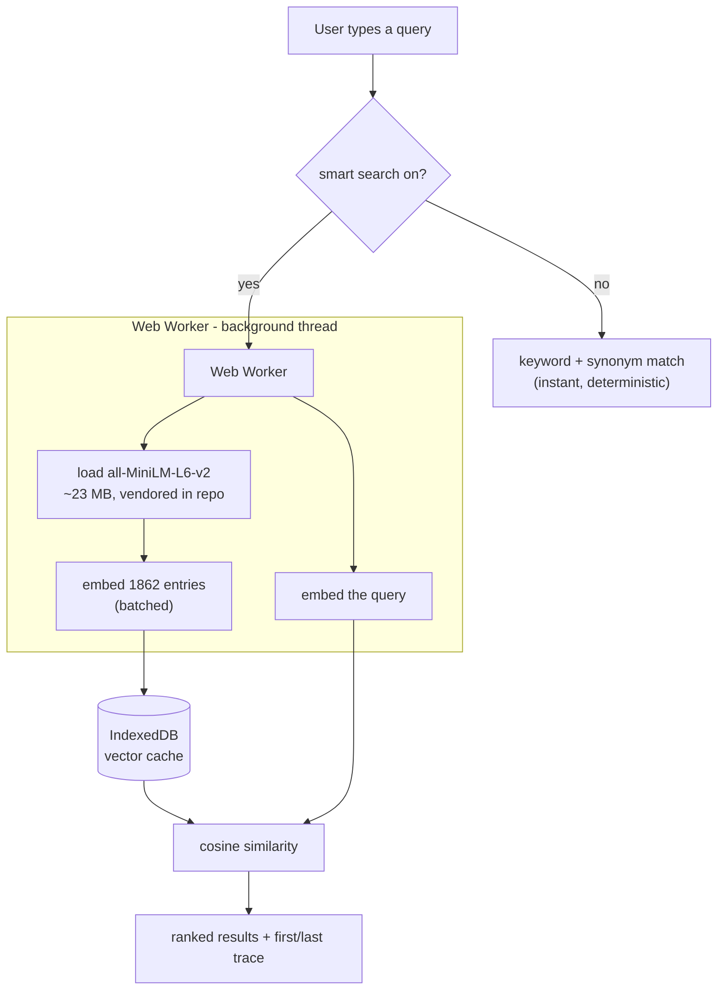

# dig

A searchable index of [The Nibble](https://nibbles.dev) - the timeless bits
(tools, TILs, reads, quotes) pulled out of every edition of the newsletter, with
the week's news left behind, **plus the links shared across the Discord
channels**. Answers "when did we first and last talk about X" for any tag or
search term - across both sources, deduped.

Live at **https://dig.nibbles.dev**

## Hosting

`index.html` is a single self-contained static file - the full index is inlined,
all logic is vanilla JS, no build step or backend at runtime. It's served by
GitHub Pages (see `CNAME`; `.nojekyll` disables Jekyll so `models/` and
`vendor/` are served as-is). To ship: commit and push.

Even the optional smart-search model is vendored into the repo (`models/` and
`vendor/transformers/`), so the search stack pulls nothing from a third-party CDN
at runtime. The two webfonts are the one exception - they still come from Google
Fonts.

## The pipeline

Two sources feed one page. They are built by separate scripts on purpose: the
Substack export is a manual download that only exists on a laptop, while Discord
refreshes daily in CI and has to rebuild the page **without** it.

```
~/Downloads/nibble-archive  --build-index.py-->  data/nibble.json  ---.
                                                                      |
Discord channels --fetch-discord.py-->  data/discord.json  ---.       |
                                             |                |       |
                        enrich-links.py -->  data/link-meta.json      |
                                                              |       |
                                     build-page.py  <---------'-------'
                                             |
                                     index.html (BOOTSTRAP inlined)
```

`build-page.py` is the only script that writes `index.html`, and it is pure:
same inputs, same page. Everything under `data/` is committed, which is what
lets the daily job rebuild without the Substack archive.

### Daily, in CI

`.github/workflows/daily-discord.yml` runs at 04:17 UTC: harvest new messages,
fetch metadata for links it has never seen, rebuild, commit. It needs two repo
secrets:

| secret | what |
| --- | --- |
| `DISCORD_TOKEN` | a **bot** token, with the bot in the server and `Read Message History` on the channel |
| `DISCORD_CHANNEL_IDS` | comma-separated channel ids (right-click a channel -> Copy Channel ID, with Developer Mode on) |

A personal account token works against the same endpoint - set
`DISCORD_TOKEN_TYPE=user` - but self-botting breaks Discord's ToS and the risk
lands on the account. A bot token is free, scoped read-only, and survives a
password change, which a user token does not.

### By hand

```sh
# newsletter side - only when a new edition lands
# (Substack -> Settings -> Exports -> unzip to ~/Downloads/nibble-archive/)
python3 build-index.py

# discord side
export DISCORD_TOKEN=... DISCORD_CHANNEL_IDS=111,222,333   # TYPE=user if personal
python3 fetch-discord.py --backfill        # first run: walk every history
python3 fetch-discord.py                   # after that: only what is new
python3 fetch-discord.py --only 444        # just-added channel, backfill one
python3 enrich-links.py                    # titles + blurbs for bare links

# merge, dedupe, inline
python3 build-page.py
```

No token to hand? `python3 make-fixture.py` writes a synthetic harvest that
exercises the whole pipeline - cross-source duplicates, short links, tracking
params, chat furniture - so the merge can be tested end to end offline.

If the entry count changed, regenerate the precomputed smart-search vectors
(needs `onnxruntime`, `tokenizers`, `numpy`):

```sh
python3 build-vectors.py   # embeds the corpus with the vendored model -> vectors.f32
```

This is not urgent: the page checks `vectors.f32` against the corpus size and
falls back to embedding in the browser when they disagree, so smart search keeps
working - just slower on first load. CI rebuilds vectors weekly rather than
daily, because the file is 2.7 MB and rewritten whole every time.

### Channels

Each channel keeps its own cursor, so adding one to `DISCORD_CHANNEL_IDS`
backfills only that channel and leaves the rest untouched. The channel name
becomes the row's label (where an edition entry shows its section) and is part
of the search haystack, so `#reads` is a searchable term. A channel whose name
says what it holds also overrides the kind heuristic - a link in `#reads` is
filed as a Read even when it points at GitHub.

Dedupe runs across channels as well as across sources: the same link in
`#tools` and `#reads` is one entry, and the row says `also in #tools`.

## Dedupe

Most Discord links are duplicates - of each other, or of something that later
ran in an edition. `taxonomy.canonical()` reduces a url to a dedupe key: drops
tracking params, unifies `youtu.be` with `youtube.com/watch`, collapses any
GitHub url to its `owner/repo`. Addressing params are **kept**, so the videos on
`youtube.com/watch` and the threads on `news.ycombinator.com/item` stay distinct
- a false split leaves a visible duplicate, a false merge silently deletes an
entry, and splitting is the safer failure.

One row survives per key. The newsletter copy wins the display, since it carries
a hand-written description; every other sighting folds into `also`, and the
entry's `first` date becomes the earliest sighting **anywhere**. That is what
makes the row read `#100 · first in Discord, Nov 2024` - the archive can now
show that the channel found something months before the edition ran it.

Descriptions come from the message text when someone said something substantial,
and from the link's own metadata otherwise (OpenGraph, plus the GitHub, YouTube,
Wikipedia and Hacker News APIs where they exist).

## What it does / doesn't

- **Editions #1-#100.** News is excluded (temporal); tools, curiosity, TILs,
  reads and quotes are kept. Unknown section headings are parked in Curiosity and
  reported, never dropped.
- **First/last trace** works for any tag chip *and* any free-text query.
- URL reflects state (`#q=...`, `#tag=...`), so a first/last view is a shareable link.

## Descriptions and edition links

Each entry links to its source, and its edition number links back to that edition
on Substack (`nibbles.dev/p/<slug>`). This is edition-level, since Substack has no
reliable per-line anchor.

Descriptions are extracted as the text after the first link, so `build-index.py`
tidies them deterministically (strips stray leading punctuation and a dangling
"and"/"but", capitalizes, adds a full stop). For an extra polish pass, an
**opencode** sub-agent can rewrite them:

```sh
python3 build-index.py                          # also writes descriptions.todo.json
opencode run "$(cat rewrite-descriptions.md)"   # writes descriptions.json
python3 build-index.py                          # merges + re-inlines into index.html
```

The rewritten text goes to a separate `descriptionClean` field and the page
prefers it; the deterministic `description` (ground truth) is never overwritten.
`descriptions.json` is committed; `descriptions.todo.json` is an intermediate.

## How search works

There are two search modes. The fast one is always on; the smart one is on by
default and can be toggled off.

### 1. Keyword + synonym (default, instant, no download)

Token/prefix matching over each entry's title, description, heading, domain and
tags, plus a hand-written concept-synonym layer. Typing `rag` expands to `vector`,
`embedding`, `langchain`, etc., so it reaches those tools even when an entry never
says "rag". Matching is token/prefix based, not raw substring, so `rag` does not
match "leve**rag**e". Fully deterministic and offline.

### 2. Smart search (on by default, in-browser semantic / "RAG retrieval")

This is the retrieval half of a RAG pipeline - semantic search, no generation, no
server. An embedding model runs **in the browser** via WebAssembly (ONNX Runtime
through [transformers.js](https://github.com/xenova/transformers.js)). All of the
heavy work happens in a **Web Worker**, so the page never freezes.



Step by step:

1. **Toggle on.** The worker imports the vendored transformers.js and
   loads `all-MiniLM-L6-v2` (quantized, ~23 MB) from the repo (`vendor/` +
   `models/`), then the browser caches it. Status line: "Setting up smart search…".
   It warms up in the background on load; keyword search answers meanwhile.
2. **Load the corpus vectors.** The 1,862 doc vectors are precomputed at build
   time (`build-vectors.py`) and shipped as `vectors.f32`, so the browser just
   fetches them - no first-load embedding. They are cached in **IndexedDB** keyed
   to the corpus. If `vectors.f32` is missing or stale, the worker falls back to
   embedding the corpus in-browser (reporting "Setting up smart search… N/1862").
3. **Query.** Each query is embedded by the same model (in the worker). The main
   thread computes cosine similarity against the cached vectors (normalized, so
   it's a dot product), then fuses that ranking with the keyword one (see below).
4. **Fallback.** While the model warms up, keyword search still answers. If the
   model fails to load, smart search turns itself off and keyword search remains.

### 3. How the two are combined

Smart search does not replace keyword search; the two rankings are fused with
reciprocal rank fusion, and every entry the keyword matcher accepts is kept
regardless of its cosine, so a semantic near-miss can never bury an exact match.
A literal hit always outranks a synonym one - searching `claude` puts Anthropic
entries above the OpenAI and Gemini entries that share its synonym group - and
terms are weighted by inverse document frequency, so a common word in a long
question counts for less than a distinctive one.

**When there are no results.** A cosine floor cannot tell a real query from a
keyboard mash: `python3 build-vectors.py --probe` scores 30 gibberish strings
against the corpus and their top match reaches 0.51, higher than the weakest of
20 genuine queries. So nonsense is caught the only way that works - a query none
of whose words appear anywhere in the archive returns nothing, rather than the
twenty least-dissimilar rows. The same applies to a real word the archive has
never covered, which is the honest answer too.

Results are paginated, 20 to a page (or 50 or 100). The page is part of the URL
alongside the query, so any page of any search is a link.

**Cost / tradeoffs.** One-time ~23 MB model download (then cached). First-query
latency is the model load plus a one-time corpus embed; instant after that. The
search stack has no third-party runtime dependency - the library, WASM runtime
and model are all served from `dig.nibbles.dev` (they add ~42 MB to the repo).
Only the webfonts are still fetched from Google.
