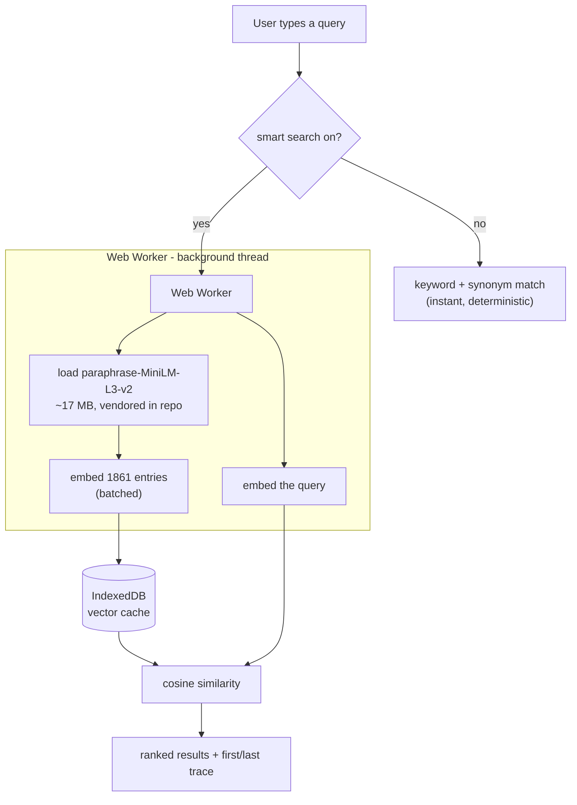

# dig

A searchable index of [The Nibble](https://nibbles.dev) - the timeless bits
(tools, TILs, reads, quotes) pulled out of every edition of the newsletter, with
the week's news left behind. Answers "when did we first and last talk about X"
for any tag or search term.

Live at **https://dig.nibbles.dev**

## Hosting

`index.html` is a single self-contained static file - the full index is inlined,
all logic is vanilla JS, no build step or backend at runtime. It's served by
GitHub Pages (see `CNAME`; `.nojekyll` disables Jekyll so `models/` and
`vendor/` are served as-is). To ship: commit and push.

Even the optional smart-search model is vendored into the repo (`models/` and
`vendor/transformers/`), so nothing is fetched from a third-party CDN at runtime.

## Regenerating the index

The data is produced from a Substack export by a **heuristic** parser
(`build-index.py`) - deterministic regex, best-effort tagging. It is *not* a
canonical system of record; a future canonical parser can overwrite the inlined
data wholesale.

```sh
# 1. Substack -> Settings -> Exports -> download, unzip to ~/Downloads/nibble-archive/
#    (expects posts/ of {id}.{slug}.html + posts.csv)
# 2. inline the fresh index straight into index.html:
python3 build-index.py

# optional: also write the raw index as JSON
python3 build-index.py --json index.json
```

`build-index.py` rewrites the `const BOOTSTRAP = ...` line in `index.html` in
place, so the page stays self-contained.

If the data changed, also regenerate the precomputed smart-search vectors (needs
`onnxruntime`, `tokenizers`, `numpy`):

```sh
python3 build-vectors.py   # embeds the corpus with the vendored model -> vectors.f32
```

## What it does / doesn't

- **Editions #1-#100.** News is excluded (temporal); tools, curiosity, TILs,
  reads and quotes are kept. Unknown section headings are parked in Curiosity and
  reported, never dropped.
- **First/last trace** works for any tag chip *and* any free-text query.
- URL reflects state (`#q=...`, `#tag=...`), so a first/last view is a shareable link.

## Descriptions and edition links

Each entry links to its source, and its edition number links back to that edition
on Substack (`nibbles.dev/p/<slug>`). This is edition-level, since Substack has no
reliable per-line anchor.

Descriptions are extracted as the text after the first link, so `build-index.py`
tidies them deterministically (strips stray leading punctuation and a dangling
"and"/"but", capitalizes, adds a full stop). For an extra polish pass, an
**opencode** sub-agent can rewrite them:

```sh
python3 build-index.py                          # also writes descriptions.todo.json
opencode run "$(cat rewrite-descriptions.md)"   # writes descriptions.json
python3 build-index.py                          # merges + re-inlines into index.html
```

The rewritten text goes to a separate `descriptionClean` field and the page
prefers it; the deterministic `description` (ground truth) is never overwritten.
`descriptions.json` is committed; `descriptions.todo.json` is an intermediate.

## How search works

There are two search modes. The fast one is always on; the smart one is on by
default and can be toggled off.

### 1. Keyword + synonym (default, instant, no download)

Token/prefix matching over each entry's title, description, heading, domain and
tags, plus a hand-written concept-synonym layer. Typing `rag` expands to `vector`,
`embedding`, `langchain`, etc., so it reaches those tools even when an entry never
says "rag". Matching is token/prefix based, not raw substring, so `rag` does not
match "leve**rag**e". Fully deterministic and offline.

### 2. Smart search (on by default, in-browser semantic / "RAG retrieval")

This is the retrieval half of a RAG pipeline - semantic search, no generation, no
server. An embedding model runs **in the browser** via WebAssembly (ONNX Runtime
through [transformers.js](https://github.com/xenova/transformers.js)). All of the
heavy work happens in a **Web Worker**, so the page never freezes.



Step by step:

1. **Toggle on.** The worker imports the vendored transformers.js and
   loads `paraphrase-MiniLM-L3-v2` (quantized, ~17 MB) from the repo (`vendor/` +
   `models/`), then the browser caches it. Status line: "Setting up smart search…".
   The download is **deferred to first intent** — it starts when you focus the
   search box (or open a shared `#q=` link), not on page load, so a plain visit
   costs nothing. Keyword search answers instantly and while the model loads.
2. **Load the corpus vectors.** The 1,861 doc vectors are precomputed at build
   time (`build-vectors.py`) and shipped as `vectors.f32`, so the browser just
   fetches them - no first-load embedding. They are cached in **IndexedDB** keyed
   to the corpus. If `vectors.f32` is missing or stale, the worker falls back to
   embedding the corpus in-browser (reporting "Setting up smart search… N/1861").
3. **Query.** Each query is embedded by the same model (in the worker). The main
   thread computes cosine similarity against the cached vectors (normalized, so
   it's a dot product) and ranks entries above a similarity threshold.
4. **Fallback.** While the model warms up, keyword search still answers. If the
   model fails to load, smart search turns itself off and keyword search remains.

**Cost / tradeoffs.** One-time ~17 MB model download on first search (then cached). First-query
latency is the model load plus embedding your query; instant after that.
There are no third-party runtime dependencies - the library, WASM runtime and
model are all served from `dig.nibbles.dev` (they add ~36 MB to the repo).
